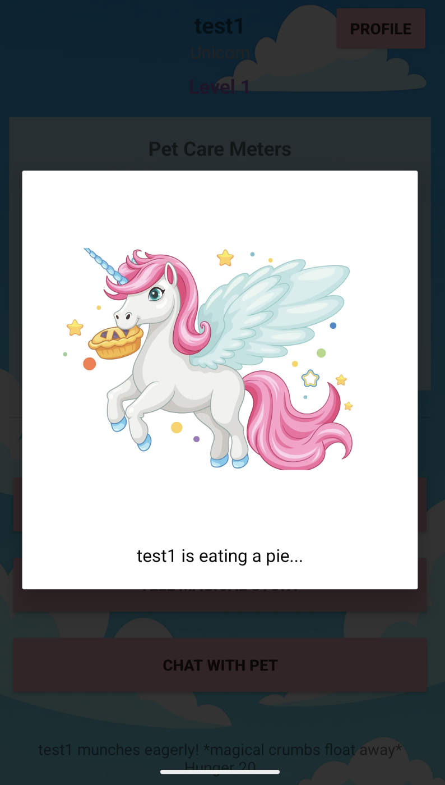
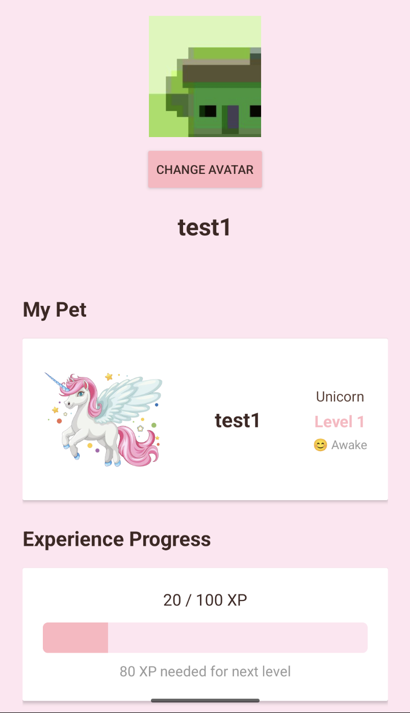
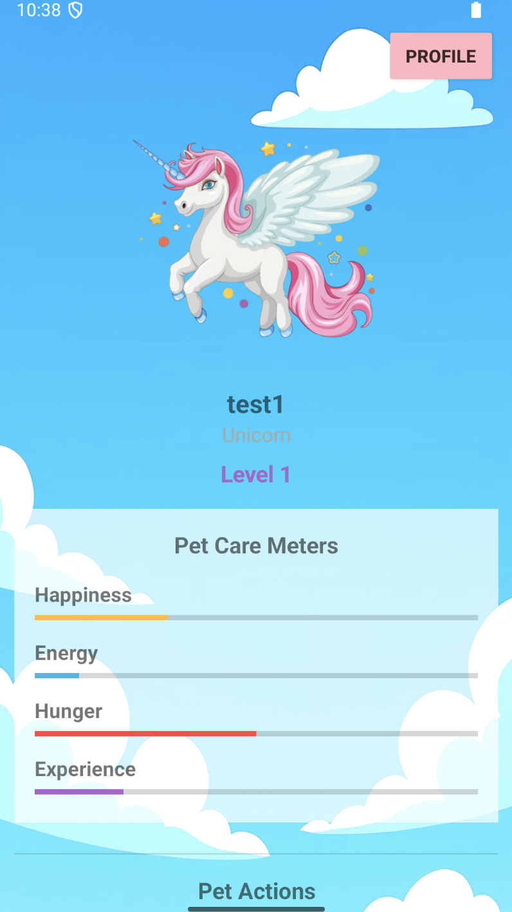

# IMPROVED CAPABILITIES SINCE 2.4

## 1. Chat History Feature
Implemented in `app/src/main/java/com/example/chatpet/ChatActivity.kt`. The Chat page now displays all previous messages sent and received from the pet, including the timeline of the messages.

## 2. Updated Navigation and UI
Updated the navigation in order to ensure that the user is directed to their pet rather than the chat immediately after logging in or registering. The user interface of the main page was also updated to include a button allowing the user to reach the pet chat page. Along with this, file references within code and names were changed to reflect UI updates, which also include updated images for a cleaner look.

## 3. Disabled Chat While Pet is Asleep
Chat was still allowed while the pet was asleep; it is disabled now, implemented in `app/src/main/java/com/example/chatpet/ChatActivity.kt`. Verified that all other pet actions are disabled too while sleeping by running the PetLogicBlackTest test cases and passing them. The buttons in the pet screen were in one column, I changed the UI (in `app/src/main/res/layout/activity_pet.xml`) to neatly put them into columns so the user doesn't have to scroll too much to click on any button.

## 4. Fixed Chat When Happiness Meter is Full
Fixed issue where user was still able to chat even when happiness meter is full. Added this functionality with a boolean flag, and also fixed test cases that were failing due to main page refactor (in ChatTests).

  
  
  

## 5. Added Visual Feedback for Actions
Added more visual feedback when each action is performed.

## 6. User Account Page
Added a user account page.

## 7. Background Display and UI Refinement
Display background on status page, convert the button layout and refine UI.

## 8. Email Format Check During Registration
Added email validation to ensure proper email format during the registration process.
