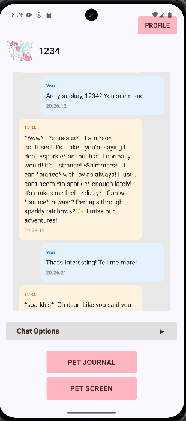
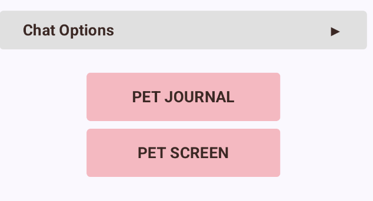
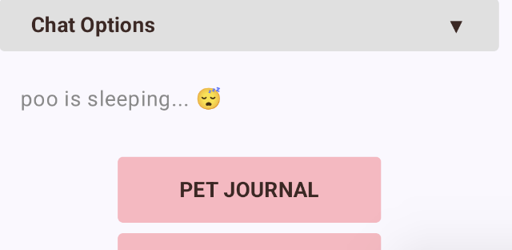
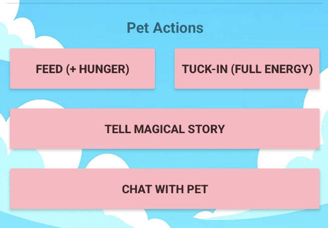

-- IMPROVED CAPABILITIES SINCE 2.4 --

1. Chat History Feature implemented in app/src/main/java/com/example/chatpet/ChatActivity.kt. The Chat page now displays all previous messages sent and received from the pet, including the timeline of the messages.

2. Lillie: Updated the navigation in order to ensure that the user is directed to their pet rather than the chat immediately after logging in or registering. The user interface of the main page was also updated to include a button allowing the user to reach the pet chat page. Along with this, file references within code and names were changed to reflect UI updates, which also include updated images for a cleaner look.
3. Aakanksha Peeru: Chat was still allowed while the pet was asleep; it is disabled now, implemented in app/src/main/java/com/example/chatpet/MainActivity.kt. Verified that all other pet actions are disabled too while sleeping by running the PetLogicBlackTest test cases and passing them. The buttons in the pet screen were in one column, I changed the UI(in app/src/main/res/layout/activity_pet.xml) to neatly put them into columns so the user doesn't have to scroll too much to click on any button. 

